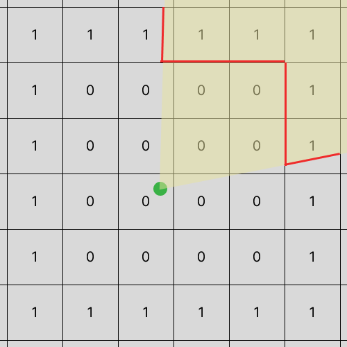
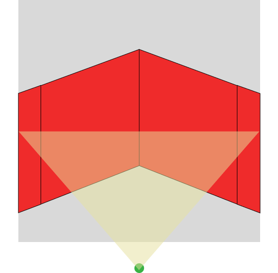
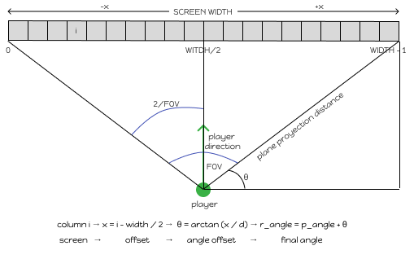
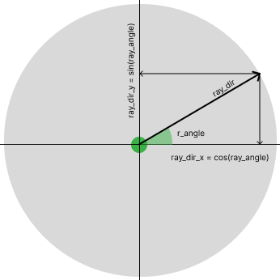
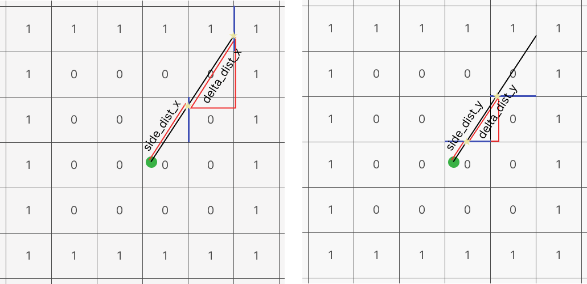
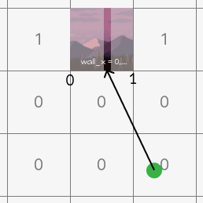

*This project has been created as part of the 42 curriculum by medel-ca and fda-roch.*

# Description

cub3D is a faux 3D game engine inspired by the 90s *Wolfenstein 3D*, written in C using the **MiniLibX** graphical library. This project parses a `.cub` file as a 2D grid map into an immersive 3D perspective using ray-casting algorithms.

# Instructions

## Prerequisites

cub3D requires a Linux environment with X11 support.

### MiniLibX

MiniLibX is a graphics library for creating windows and rendering pixels. In our project it is automatically downloaded from its Git repository (with Makefile), but we can also find it in the cub3D project page.

**MiniLibX** dependencies (X11 / Xshm / Xlib).
These libraries are required for MiniLibX:

In Ubuntu/Debian we can install it with these 3 steps:

1. X11 Development Libraries (to create windows and handle graphics)
	
	`sudo apt-get update`

	`sudo apt-get install libx11-dev libxext-dev`

2. Math Library (for trigonometric calculations)

	`sudo apt-get install libm-dev`

3. Build Essentials (basic build tools)

	`sudo apt-get install build-essential`

###  Libft

Libft is a custom C standard library implementation. It is in the libft/ directory.

## Compilation

The Makefile handles all dependencies automatically with:

 `make`

It will build MiniLibX (libmlx.a), build Libft (libft.a), compile all Cub3D source files and link everything into the `cub3d` executable.

The compiler flags used are:

`-Wall -Wextra -Werror` (enable all warnings and treat them as errors)

`-O3` (maximum optimization for performance)

`-g` (include debug symbols)

All compilation commands:

| Command | Description |
| ------- | ----------- |
| `make` or `make all` | Build the complete project |
| `make clean` | Remove object files (.o) |
| `make fclean` | Remove object files and the executable |
| `make re`| Rebuild everything from scratch without bonus |
| `make bonus`| Build the complete project plus bonus features (wall collision, minimap and mouse)

## Execution

Launch cub3D from its directory by using one of the example maps:

`./cub3D maps/map.cub`

## Controls

cub3D uses a simple keyboard-based control. 

**W / S**: Move forward / backward.

**A / D**: Move left / right.

**Left Arrow / Right Arrow**: Camera rotation that directly modifies the player's viewing angle.

**M**: Toggle Mouse mode that controls the camera rotation too. It is turned on by default.

**N**: Toggle Minimap, turned on by default.

**ESC / Window Close (X)**: Exits the game.

---
---

## Custom Ray-casting Implementation

Ray-casting is a rendering technique used to create a 3D perspective from a 2D map. It is highly efficient because it only requires one calculation per vertical screen column. Our implementation is limited to walls of uniform height represented as orthogonal square tiles on a 2D grid.

The goal of ray-casting is to detect the walls surrounding the player within the camera's field of view and calculate their distance from the player. This distance is then used to determine the apparent wall height on the screen.

For each vertical screen column (each x-coordinate), a ray is cast from the player's position. Its direction depends on both the player's viewing angle and the column's position on the screen. The ray traverses the 2D map until it intersects a wall. Once a collision is detected, the distance between the player and the wall is calculated and used to determine the wall's projected height. The farther away a wall is, the smaller it appears on the screen.

## Coordinate Systems

The engine operates using three distinct coordinate spaces.

### 1. Pixel Space (World Space)

This is the raw coordinate system used to store the player's position:

- `p_x`, `p_y` are expressed in pixels
- The origin depends on the map layout
- Each tile has a fixed size defined by `TILE_SIZE`

This is the “physical” space in which the player moves.

### 2. Grid Space (Map Space)

The game map is represented as a 2D grid of square tiles.

Each tile corresponds to a fixed number of pixels:

$$
map\_x = \frac{p_x}{TILE\_SIZE}, \quad map\_y = \frac{p_y}{TILE\_SIZE}
$$

In this space:

- Each cell represents a wall or empty space
- DDA (Digital Differential Analysis) operates on integer tile transitions
- This is the space used for collision detection and ray traversal

### 3. Direction Space

Ray directions are not expressed in pixels or tiles, but as mathematical unit vectors derived from an angle:

$$
ray\_dir_x = \cos(ray\_angle), \quad ray\_dir_y = \sin(ray\_angle)
$$

This defines a continuous direction independent of scale:

- Values are normalized ([-1, 1])
- Represent direction only, not position
- Used to simulate infinite ray propagation through the grid

### Relationship Between Spaces

The ray-casting pipeline connects these spaces as follows:

1. The player moves in **pixel space**
2. The map is interpreted in **grid space**
3. The ray is defined in **continuous direction space**
4. The DDA algorithm converts the continuous ray into discrete grid steps

This conversion is what allows the engine to efficiently detect wall intersections in a 2D map while rendering a 3D projection.

## The Angular Approach (our method)
While many ray-casting tutorials (such as Lodev) use a Vector Plane approach, we used the **Angular Method** for ray generation.

Instead of using a moving camera plane vector, we use the player's view orientation as a continuous floating-point angle in radians (`p_angle`). For each vertical column `i` across the `WIDTH` ($1920$), we step through target angles stored inside `start_angle[i]`.

Instead of stepping through the field of view using a constant angular increment, each ray angle is derived from its position on the projection plane. The projection plane distance is computed from the desired FOV:

$$ projection_plane_distance = \frac{WIDTH / 2}{\tan(FOV / 2)}$$

For every screen column *i*, we compute its horizontal offset from the screen center:

$$ x = i - \frac{WIDTH}{2} $$

The corresponding ray angle offset is:

$$ \theta = \arctan\left(\frac{x}{projection_plane_distance}\right) $$

Finally:

$$ ray_angle = player_angle + \theta $$

This approach models a flat projection plane and associates each ray directly with a screen column, producing a more geometrically accurate camera model than a simple uniform angular sweep.

### 1. **Ray Vector Derivation:**
   For every column, the horizontal and vertical components of the ray are extracted directly via basic trigonometric functions:

$$ ray\_dir\_x = \cos(\ray\_angle) $$

$$ ray\_dir\_y = \sin(\ray\_angle) $$
   
   

   The grid delta metrics (`delta_dist_x` and `delta_dist_y`) represent the distance the ray must travel to cross a full grid boundary ($TILE\_SIZE = 64$) and are initialized using:

$$ \Delta\text{dist}_x = \left| \frac{1}{\cos(\text{ray\_angle})} \right|, \quad \Delta\text{dist}_y = \left| \frac{1}{\sin(\text{ray\_angle})} \right| $$

   These values determine which grid boundary the ray will hit first.

### 2. **Digital Differential Analysis (DDA):**
   Using `perform_dda`, the ray steps incrementally across grid. Variables `side_dist_x` and `side_dist_y` track accumulated distance bounds. The traversal advances column-by-column along the shortest dimensional vector until a map grid barrier (`'1'`) is intersected.
   
   `side_dist_x` and `side_dist_y` depend on the ray direction sign:

   - If the ray moves in a negative X direction, we compute the distance to the previous vertical grid line.
   - Otherwise, we compute the distance to the next vertical grid line.

   - The same logic applies to the Y axis.

   Whenever the DDA advances along the x-axis, the hit is marked as a vertical wall (side = 0).
   Whenever it advances along the y-axis, the hit is marked as a horizontal wall (side = 1)

   Although the ray is defined in **continuous direction space**, the collision detection is performed in **discrete grid space**, where each step corresponds to crossing a tile boundary.

### 3. **Fish-Eye Correction:**
   Because our rays radiate outward at equal angular steps from a central point, computing raw Euclidean distance produces radial lens distortion (flat walls appear curved). To maintain a flat projection plane, we isolate the perpendicular distance by flattening the ray against the player's focal direction vector:

$$ \text{corrected\_dist} = \text{euclidean\_dist} \times \cos(\text{ray\_angle} - \text{player\_angle}) $$

   

   *The Euclidean distance measures the ray length, but wall projection requires the distance perpendicular to the camera plane*

### 4. **Wall Texture Mapping:**

   After the DDA algorithm detects a wall collision, we use the intersection data to compute the final wall rendering.
   At this stage we already know:

   - The exact grid cell where the ray hit a wall
   - The axis and the direction of impact
   - The perpendicular distance to the wall

   #### Wall Hit Position (`wall_x`)

   To correctly map a texture, we first compute the exact fractional position of the hit inside the wall tile. This value represents where the ray intersects the wall in **grid space**, not pixel space:

   - If the hit is on a vertical wall:
   $$ wall\_x = player\_y + perp\_dist \cdot ray\_dir_y $$
   - If the hit is on a horizontal wall:
   $$ wall\_x = player\_x + perp\_dist \cdot ray\_dir_x $$

   We then extract only the fractional part:
   $$ wall\_x = wall\_x - \lfloor wall\_x \rfloor $$

   This gives a normalized coordinate in range `[0, 1]`, representing the exact hit position within the tile.

   #### Texture Coordinate Mapping

   Once `wall_x` is known, it is mapped to the texture width:

   $$ tex_x = wall_x \cdot texture\_width $$

   This determines which vertical stripe of the texture corresponds to the current screen column.

   #### Vertical Sampling

   For each pixel row of the wall slice:

   - `tex_y` is computed proportionally to screen space
   - The final texture color is fetched using:

     `offset = tex_x * bpp + tex_y * line_length;`
      
     `color = texture.addr[offset];`

   #### Wall Orientation

   The side value returned by the DDA determines which texture face is used:

   - side = 0 → vertical wall (East/West)
   - side = 1 → horizontal wall (North/South)

   Combined with the ray direction (step_x, step_y), this allows selecting the correct wall texture.

   In some cases, textures are mirrored horizontally to preserve correct orientation depending on the ray direction.

   #### Final Rendering Step

   Each computed pixel color is written into a frame buffer that stores:

   - ceiling
   - walls
   - floor

   Once all columns are processed, the buffer is displayed as a single frame using the rendering backend.

## Key Features

These features are activated by using `make bonus`

- **Sliding Collision System:** Independent axis checking using a player boundaries threshold (`PLAYER_RADIUS` = 10) to support fluid movement when close to the walls.
- **Minimap:** Toggleable ($2D$) map showing wall grids, player position, and live projection ray casting beams (by pressing N).
- **Mouse camera rotation:** Toggleable camera rotation with mouse (by pressing M).

## Resources

- [Lode's Computer Graphics Tutorial](https://lodev.org/cgtutor/raycasting.html)
- [Permandi's Ray-Casting Tutorial](https://permadi.com/1996/05/ray-casting-tutorial-table-of-contents/)
- [Cub3D by Fran Byte](https://42-fran-byte-f94097.gitlab.io/docs/cub3d/cub3d-approach-es/#/)
- [Cub3D by Jun Han Ng](https://hackmd.io/@nszl/H1LXByIE2)
- [3D Ray-casting Game with Cub3D](https://devabdilah.medium.com/3d-ray-casting-game-with-cub3d-7a116376056a)
- [Ray-casting - Medium](https://ismailassil.medium.com/ray-casting-c-8bfae2c2fc13)

### AI usage

AI was used in this project as a tool to explain concepts we didn't know or had forgotten, to guide our search for tutorials, to rename functions and variables, and to check for grammatical errors in this README.